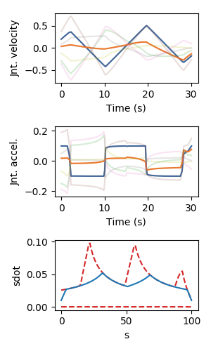

# `toppra`

TOPP-RA is the latest theoretical development for solving the Time-Optimal Path Parameterization (TOPP) problem. TOPP-RA achieves 100% success rate while being faster than the state-of-the-art implementation of the [classic Bobrow algorithm](https://github.com/quangounet/TOPP). The current implementation of TOPP-RA supports the following constraints :

1. joint velocity and acceleration bounds;
2. torque bounds (including redundantly-actuated manipulators);
3. contact stability for legged robots.

Refer to the accompanying paper [A new approach to Time-Optimal Path Parameterization based on Reachability Analysis](https://arxiv.org/abs/1707.07239) for more details.


# Installation
## Basic

From pip

``` sh
pip install Cython numpy coloredlogs enum scipy
```

to run the examples, you need in addition

``` sh
pip install matplotlib
```


Install
[qpOASES](https://projects.coin-or.org/qpOASES/wiki/QpoasesInstallation) by
following steps given in the official site. Then, to install the
python interface do
``` sh
cd <install-dir>/interfaces/python
pip setup.py install
```


Finally, install `toppra` with
``` sh
python setup.py install
```
after installation complete, run tests by doing
``` sh
cd <toppra-dir>/tests/
pytest -v
```
if `pytest` is not installed, grab it from `pip`.


## Multi-contact and torque bounds examples
To use these functionality, the following libraries are needed:

1. [openRAVE](https://github.com/rdiankov/openrave)
2. [pymanoid](https://github.com/stephane-caron/pymanoid)

`openRAVE` can be tricky to install, a good instruction for installing
`openRAVE` on Ubuntu 16.04 can be
found
[here](https://scaron.info/teaching/installing-openrave-on-ubuntu-16.04.html).

To install `pymanoid` locally, do the following
``` sh
mkdir git && cd git
git clone <pymanoid-git-url>
export PYTHONPATH=$PYTHONPATH:$HOME/git/pymanoid
```


# Basic usage

The following code snippets shows basic usage of `toppra`. We will
first define the constraints, which in this case are kinematic
constraints, and second generate a random geometric path. Finally, we
parametrize the path using `toppra.


First, import necessary functions
```python
from toppra import (create_velocity_path_constraint,
                    create_acceleration_path_constraint,
                    qpOASESPPSolver,
                    compute_trajectory_gridpoints,
                    smooth_singularities,
		    SplineInterpolator,
                    interpolate_constraint)
import numpy as np
```
Then, generate a random instance
```python
N = 100
N_samples = 5
dof = 7
np.random.seed(1)
way_pts = np.random.randn(N_samples, dof)
path = SplineInterpolator(np.linspace(0, 1, N_samples), way_pts)
ss = np.linspace(0, 1, N + 1)
# Velocity Constraint
vlim_ = np.random.rand(dof) * 20
vlim = np.vstack((-vlim_, vlim_)).T
pc_vel = create_velocity_path_constraint(path, ss, vlim)
# Acceleration Constraints
alim_ = np.random.rand(dof) * 2
alim = np.vstack((-alim_, alim_)).T
pc_acc = create_acceleration_path_constraint(path, ss, alim)
constraints = [pc_vel, pc_acc]
constraints_intp = [interpolate_constraint(c) for c in constraints]
```
Finally, solve with `toppra`
```python
pp = qpOASESSolver(constraints)
us, xs = pp.solve_topp()
t, q, qd, qdd = compute_trajectory_gridpoints(path, pp.ss, us, xs)
```
We can now plot the solution with `matplotlib`
``` python
# plotting
import matplotlib.pyplot as plt
f, axs = plt.subplots(3, 1, figsize=[3, 5])
axs[0].plot(t, qd[:, [1, 2]])
axs[0].plot(t, qd, alpha=0.2)
axs[1].plot(t, qdd[:, [1, 2]])
axs[1].plot(t, qdd, alpha=0.2)
axs[2].plot(np.sqrt(pp.K[:, 0]), '--', c='C3')
axs[2].plot(np.sqrt(pp.K[:, 1]), '--', c='C3')
axs[2].plot(np.sqrt(xs))
plt.show()
```
This figure should appear!



For more examples, see the /examples folder.

