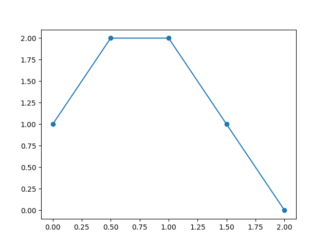

Quickstart
^^^^^^^^^^^^^^^^^^^^^^^

Represent geometric path and trajectory
=====================================================

.. currentmodule:: toppra.interpolator

In TOPP-RA, both geometric paths :math:`\mathbf q(s)_{s \in [0, 1]}`
and parametrized trajectories :math:`\mathbf q(t)_{t \in [0, T]}` are
represented by classes that implement the abstract interface
:class:`~AbstractGeometricPath`. The most important function is
:func:`~AbstractGeometricPath.__call__` which can be used to evaluate
the configuration, first-derivatives and second-derivatives
respectively.

Spline Interpolator
--------------------

In the examples, the child class :class:`toppra.SplineInterpolator` is
used extensively, due to the expressiveness and convenience offered by
cubic spline. Note that this class is implemented as a thin wrapper
over `scipy`'s :class:`~scipy.interpolate.CubicSpline`. Therefore, it
requires `scipy` to work
properly. :class:`~toppra.SplineInterpolator`'s usage is simple.

.. code-block:: python

   import toppra
   s_array = [0, 1, 2]
   wp_array = [(0, 0), (1, 2), (2, 0)]
   path = toppra.SplineInterpolator(s_array, wp_array)

That's it. To verify that is works correctly, let's try plotting. 

.. code-block:: python

   import numpy as np
   import matplotlib.pyplot as plt
   s_sampled = np.linspace(0, 2, 100)
   q_sampled = path(s_sampled)
   plt.plot(s_sampled, q_sampled)
   plt.show()

You will see the following plot show up.

.. figure:: _static/geometric_path.png

  Geometric path plot.
	   

The derivatives can be inspected by calling `path(positions, order)`
using `order=1` for the first derivative and `order=2` for the second
derivative respectively.

>>> q_dot = path(s_sample, 1)
>>> q_ddot = path(s_sample, 2)

Implement your own Interpolator
-------------------------------

TOPP-RA can handle custom Interpolators easily, as long as it conforms
to the abstract interface of
:class:`toppra.interpolator.AbstractGeometricPath`.

Retime geometric paths with parametrization
===============================================

The parametrization step, given a fixed time-parametrization
:math:`s(t)` and a geometric path :math:`\mathbf{p}(s)`, is defined
like so:

.. math::

   \mathbf q(t) &= \mathbf p(s(t)) \\
   \dot{\mathbf p}(t) &= \mathbf p'(s) \dot s(t) \\
   \ddot{\mathbf p}(t) &= \mathbf p'(s) \ddot s(t) + \mathbf p''(s) \dot s(t)^2

`toppra` provides way to realize this step programmatically. Consider
a simple geometric path

>>> import toppra
>>> path = toppra.SplineInterpolator([0, 1, 2], [(0, 0), (1, 2), (2, 0)])

Let's consider a simple parametrization

>>> gridpoints = [0, 0.5, 1, 1.5, 2]
>>> velocities = [1, 2, 2, 1, 0]

We can quickly parametrize the geometric path with `toppra`:

>>> path_new = toppra.ParametrizeConstAccel(path, gridpoints, velocities)

.. currentmodule:: toppra.interpolator

Under the hood, :class:`~ParametrizeConstAccel` assumes that the path
acceleration within each segment is constant. Combining with the
function composition rule, the original is
parametrized. :class:`~ParametrizeConstAccel` derives from
:class:`~AbstractGeometricPath` and defines all specified methods such
as computing the positions, derivatives and duration.

Any geometric path implementing the abstract geometric path interface
can be used with :class:`~ParametrizeConstAccel`.

The parametrization can be inspected

>>> path_new.plot_parametrization(show=True)

	    
   Parametrization.

Let's play around to see that the parametrization make sense:

>>> path(0, 0) == path_new(0, 0)

>>> import toppra

