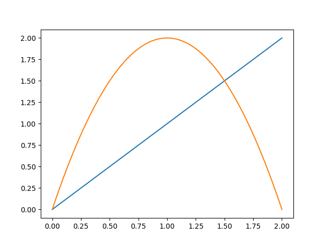
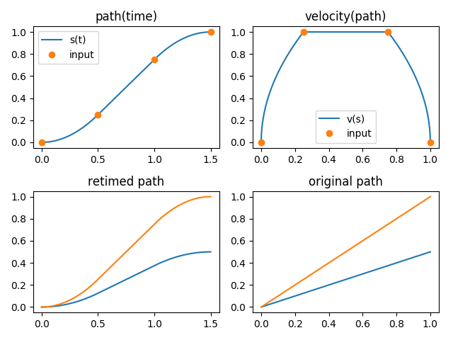
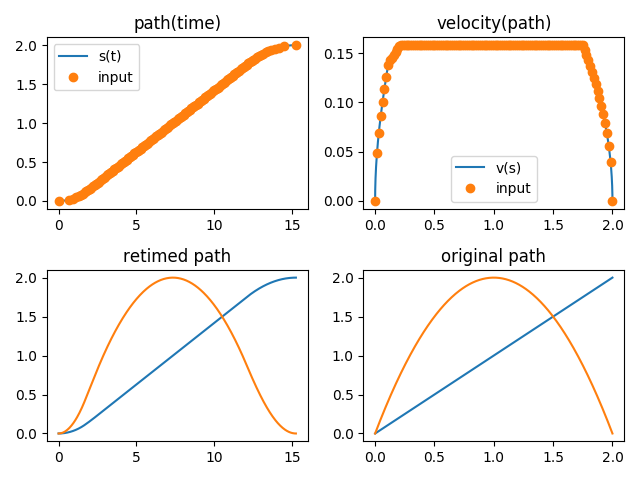

Quickstart
^^^^^^^^^^^^^^^^^^^^^^^

Represent geometric path and trajectory
=====================================================

.. currentmodule:: toppra.interpolator

In TOPP-RA, both geometric paths :math:`\mathbf q(s)_{s \in [0, 1]}`
and parametrized trajectories :math:`\mathbf q(t)_{t \in [0, T]}` are
represented by classes that implement the abstract interface
:class:`~AbstractGeometricPath`. The most important function is
:func:`~AbstractGeometricPath.__call__` which can be used to evaluate
the configuration, first-derivatives and second-derivatives
respectively.

Spline Interpolator
--------------------

In the examples, the child class :class:`toppra.SplineInterpolator` is
used extensively, due to the expressiveness and convenience offered by
cubic spline. Note that this class is implemented as a thin wrapper
over `scipy`'s :class:`~scipy.interpolate.CubicSpline`. Therefore, it
requires `scipy` to work
properly. :class:`~toppra.SplineInterpolator`'s usage is simple.

>>> import toppra
>>> s_array = [0, 1, 2]
>>> wp_array = [(0, 0), (1, 2), (2, 0)]
>>> path = toppra.SplineInterpolator(s_array, wp_array)

That's it. To verify that is works correctly, let's try plotting. 

>>> import numpy as np
>>> import matplotlib.pyplot as plt
>>> s_sampled = np.linspace(0, 2, 100)
>>> q_sampled = path(s_sampled)
>>> q_sampled[:2]
array([[0.        , 0.        ],
       [0.02020202, 0.07999184]])
>>> plt.plot(s_sampled, q_sampled); plt.show()  #doctest: +ELLIPSIS
[<matplotlib.lines.Line2D object at 0x...>, <matplotlib.lines.Line2D object at 0x...>]

You will see the following plot show up.

  Geometric path plot.
	   

The derivatives can be inspected by calling `path(positions, order)`
using `order=1` for the first derivative and `order=2` for the second
derivative respectively.

>>> q_dot = path(s_sampled, 1)
>>> q_ddot = path(s_sampled, 2)

Implement your own Interpolator
-------------------------------

TOPP-RA can handle custom Interpolators easily, as long as it conforms
to the abstract interface of
:class:`toppra.interpolator.AbstractGeometricPath`.

Retime geometric paths with parametrization
===============================================

The parametrization step, given a fixed time-parametrization
:math:`s(t)` and a geometric path :math:`\mathbf{p}(s)`, is defined
like so:

.. math::

   \mathbf q(t) &= \mathbf p(s(t)) \\
   \dot{\mathbf p}(t) &= \mathbf p'(s) \dot s(t) \\
   \ddot{\mathbf p}(t) &= \mathbf p'(s) \ddot s(t) + \mathbf p''(s) \dot s(t)^2

`toppra` provides way to realize this step programmatically. Consider
a simple geometric path

>>> import toppra
>>> path = toppra.SplineInterpolator([0, 1, 2], [(0, 0), (1, 2), (2, 0)])

Let's consider a simple parametrization

>>> gridpoints = [0, 0.5, 1, 1.5, 2]
>>> velocities = [1, 2, 2, 1, 0]

We can quickly parametrize the geometric path with `toppra`:

>>> path_new = toppra.ParametrizeConstAccel(path, gridpoints, velocities)

.. currentmodule:: toppra.interpolator

Under the hood, :class:`~ParametrizeConstAccel` assumes that the path
acceleration within each segment is constant. Combining with the
function composition rule, the original is
parametrized. :class:`~ParametrizeConstAccel` derives from
:class:`~AbstractGeometricPath` and defines all specified methods such
as computing the positions, derivatives and duration.

Any geometric path implementing the abstract geometric path interface
can be used with :class:`~ParametrizeConstAccel`.

The parametrization can be inspected

>>> path_new.plot_parametrization(show=True)

.. figure:: _static/interpolate_param.png
	    
   Parametrization.

>>> path_new(0)
array([0., 0.])
>>> path_new.path_interval
array([0.        , 1.91666667])

Trapezoidal Reparametrization
------------------------------

It's common in automation and robotics to use trapezoidal velocity
profile, or S-curve to make a movement more *graceful*. This can be
easily implemented using the constant acceleration reparametrizer
:class:`~ParametrizeConstAccel`.

See this code snippet below.

>>> path = toppra.SplineInterpolator([0, 2], [(0, 0), (1, 2)])
>>> gridpoints, velocities = (0, 0.25, 0.75, 1.0), (0, 1, 1, 0)
>>> path_new = toppra.ParametrizeConstAccel(path, gridpoints, velocities)
>>> path_new.plot_parametrization(show=True)

	    
   Parametrization.

TODO: It will be useful to have a collection of generators that
generate these velocity profiles, based on the desired maximum
velocity, duration, et cetera.

Time-optimal retime with kinematics constraints
======================================================

The `toppra` algorithm returns the velocity profile, or the
time-parametrization profile that is optimal. The resulting trajectory
is also guaranteed to satisfy given constraints. Consider a simple
path as below for a 2-dof robot.

>>> s_array = [0, 1, 2]
>>> wp_array = [(0, 0), (1, 2), (2, 0)]
>>> path = toppra.SplineInterpolator(s_array, wp_array)

Suppose the 2 dofs are constrained by velocity and acceleration limits.

>>> pc_vel = toppra.constraint.JointVelocityConstraint([[-1, 1], [-0.5, 0.5]])
>>> pc_acc = toppra.constraint.JointAccelerationConstraint([[-0.05, 0.2], [-0.1, 0.3]])

The time-optimal velocity profile can be found easily using :class:`~TOPPRA`

>>> instance = toppra.algorithm.TOPPRA([pc_vel, pc_acc], path)
>>> instance.compute_parameterization(0, 0)

Algorithm outputs are stored in the `problem_data` attribute:

>>> instance.problem_data.return_code
<ParameterizationReturnCode.Ok: 'Ok: Successful parametrization'>
>>> instance.problem_data.gridpoints  #doctest: +ELLIPSIS
array([0.      , 0.015625, 0.03125 , 0.046875, 0.0625  , 0.078125,...])
>>> instance.problem_data.sd_vec  #doctest: +ELLIPSIS
array([...])

>>> path_new = toppra.ParametrizeConstAccel(path, instance.problem_data.gridpoints, instance.problem_data.sd_vec)
>>> path_new.plot_parametrization(show=True)

	    
   Parametrization.

